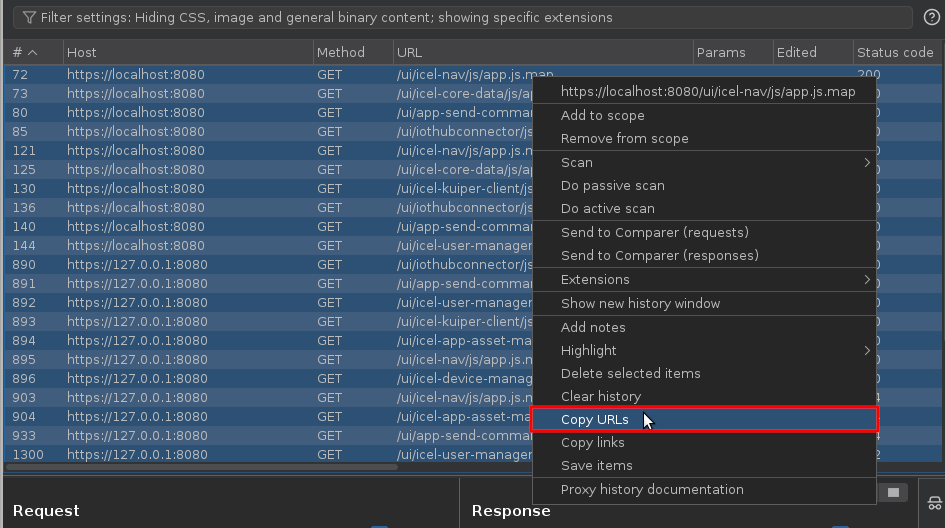

# Description
**Webpack extractor** retrieves source code files directly from webpack and recreates the tree on the file system.  
The script takes a URL or a local file as input.


# Installation

**Dependencies**  
```bash
pip3 install -r requirements.txt
```

# Usage

```bash
$> python webpack_extractor.py -h
usage: webpack_extractor.py [-h] [-s] [-u URL | -f FILE]

Extracting source files from a webpack

options:
  -h, --help            show this help message and exit
  -s, --silent          Decrease output verbosity
  -u URL, --url URL     Url to get the mapping from
  -f FILE, --file FILE  Local file to get the mapping from
```

**Exemples**  
```bash
# Local file
python webpack_extractor.py -f $file

# Single url
python webpack_extractor.py -u $url

# Multiple urls
$> for url in $(cat urls.lst); do python webpack_extractor.py -u $url -s; done
```

**With the help of BurpSuite**
1. Filter your proxy history by file extension `map`  

2. Select all the urls and copy them to a file  

3. Run the tool in a 'for' loop  
  ```bash
  for url in $(cat urls.lst); do python webpack_extractor.py -u $url -s; done
  ```
  